<p align = "center" draggable="false" >
</p>

## <h1 align="center" id="heading">Session 15: Build & Serve an A2A Endpoint for Our LangGraph Agent</h1>

| 🤓 Pre-work | 📰 Session Sheet | ⏺️ Recording     | 🖼️ Slides        | 👨‍💻 Repo         | 📝 Homework      | 📁 Feedback       |
|:-----------------|:-----------------|:-----------------|:-----------------|:-----------------|:-----------------|:-----------------|
| [Session 15: Pre-Work](https://www.notion.so/Session-15-Agent2Agent-Protocol-Agent-Ops-247cd547af3d8066bc5be493bc0c7eda?source=copy_link#247cd547af3d81369191e4e6cd62f875)| [Session 15: Agent2Agent Protocol & Agent Ops](https://www.notion.so/Session-15-Agent2Agent-Protocol-Agent-Ops-247cd547af3d8066bc5be493bc0c7eda) | [Recording!](https://us02web.zoom.us/rec/share/lgZHp8jqB5D5ytsi1gKH-wwdoz6fX0yBlJFOz5tuoGa1TMU0x7e9rKkkH4a75uUx.RC9C31cDG5Bl4UR2) (mttc.$6G)| [Session 15 Slides](https://www.canva.com/design/DAGv5Xxl3Vw/CRpCrhpika6yPjcQHwB_MQ/edit?utm_content=DAGv5Xxl3Vw&utm_campaign=designshare&utm_medium=link2&utm_source=sharebutton) | You are here! | [Session 15 Assignment: A2A](https://forms.gle/RPC6sNh2WXE6984j9) | [AIE7 Feedback 8/12](https://forms.gle/AZT2usWxqzfa1JNc8)

# A2A Protocol Implementation with LangGraph

This session focuses on implementing the **A2A (Agent-to-Agent) Protocol** using LangGraph, featuring intelligent helpfulness evaluation and multi-turn conversation capabilities.

## 🎯 Learning Objectives

By the end of this session, you'll understand:

- **🔄 A2A Protocol**: How agents communicate and evaluate response quality

## 🧠 A2A Protocol with Helpfulness Loop

The core learning focus is this intelligent evaluation cycle:

```mermaid
graph TD
    A["👤 User Query"] --> B["🤖 Agent Node<br/>(LLM + Tools)"]
    B --> C{"🔍 Tool Calls<br/>Needed?"}
    C -->|"Yes"| D["⚡ Action Node<br/>(Tool Execution)"]
    C -->|"No"| E["🎯 Helpfulness Node<br/>(A2A Evaluation)"]
    D --> F["🔧 Execute Tools"]
    F --> G["📊 Tavily Search<br/>(Web Results)"]
    F --> H["📚 ArXiv Search<br/>(Academic Papers)"]  
    F --> I["📄 RAG Retrieval<br/>(Document Search)"]
    G --> B
    H --> B
    I --> B
    E --> J{"✅ Is Response<br/>Helpful?"}
    J -->|"Yes (Y)"| K["🏁 END<br/>(Task Complete)"]
    J -->|"No (N)"| L{"🔄 Loop Count<br/>< 10?"}
    L -->|"Yes"| B
    L -->|"No"| K
    
    style A fill:#1e3a5f,stroke:#ffffff,stroke-width:3px,color:#ffffff
    style B fill:#4a148c,stroke:#ffffff,stroke-width:3px,color:#ffffff
    style C fill:#0d47a1,stroke:#ffffff,stroke-width:3px,color:#ffffff
    style D fill:#1b5e20,stroke:#ffffff,stroke-width:3px,color:#ffffff
    style E fill:#e65100,stroke:#ffffff,stroke-width:3px,color:#ffffff
    style F fill:#2e7d32,stroke:#ffffff,stroke-width:3px,color:#ffffff
    style G fill:#00695c,stroke:#ffffff,stroke-width:3px,color:#ffffff
    style H fill:#4527a0,stroke:#ffffff,stroke-width:3px,color:#ffffff
    style I fill:#283593,stroke:#ffffff,stroke-width:3px,color:#ffffff
    style J fill:#2e7d32,stroke:#ffffff,stroke-width:3px,color:#ffffff
    style K fill:#c62828,stroke:#ffffff,stroke-width:3px,color:#ffffff
    style L fill:#f57c00,stroke:#ffffff,stroke-width:3px,color:#ffffff
```



# Build 🏗️

Complete the following tasks to understand A2A protocol implementation:

## 🚀 Quick Start

```bash
# Setup and run
./quickstart.sh
```

```bash
# Start LangGraph server
uv run python -m app
```

```bash
# Test the A2A Serer
uv run python app/test_client.py
```

### 🏗️ Activity #1:

Build a LangGraph Graph to "use" your application.

Do this by creating a Simple Agent that can make API calls to the 🤖Agent Node above through the A2A protocol. 

### ❓ Question #1:

What are the core components of an `AgentCard`?

##### ✅ Answer:

## 🃏 **Core Components of an AgentCard**

### **1. Basic Identity Information**
```python:app/__main__.py
agent_card = AgentCard(
    name='General Purpose Agent',                    # ← Agent's display name
    description='A helpful AI assistant with web search, academic paper search, and document retrieval capabilities',  # ← What the agent does
    url=f'http://{host}:{port}/',                   # ← Where to find the agent
    version='1.0.0',                                # ← Agent version number
)
```

### **2. Capabilities (AgentCapabilities)**
```python:app/__main__.py
capabilities = AgentCapabilities(
    streaming=True,           # ← Can provide real-time streaming responses
    push_notifications=True   # ← Can send push notifications
)
```

**Capabilities define what the agent can do at a technical level:**
- **Streaming**: Real-time response delivery
- **Push Notifications**: Active communication with clients
- **Other capabilities** could include: authentication, rate limiting, etc.

### **3. Skills (List of AgentSkill)**
```python:app/__main__.py
skills = [
    AgentSkill(
        id='web_search',                           # ← Unique skill identifier
        name='Web Search Tool',                    # ← Human-readable skill name
        description='Search the web for current information',  # ← What the skill does
        tags=['search', 'web', 'internet'],        # ← Categorization tags
        examples=['What are the latest news about AI?'],  # ← Usage examples
    ),
    AgentSkill(
        id='arxiv_search',
        name='Academic Paper Search',
        description='Search for academic papers on arXiv',
        tags=['research', 'papers', 'academic'],
        examples=['Find recent papers on large language models'],
    ),
    AgentSkill(
        id='rag_search',
        name='Document Retrieval',
        description='Search through loaded documents for specific information',
        tags=['documents', 'rag', 'retrieval'],
        examples=['What do the policy documents say about student loans?'],
    ),
]
```

**Skills define the agent's functional abilities:**
- **id**: Unique identifier for the skill
- **name**: Human-readable name
- **description**: What the skill accomplishes
- **tags**: Categories for discovery and filtering
- **examples**: Sample queries that demonstrate the skill

### **4. Content Type Support**
```python:app/__main__.py
default_input_modes=Agent.SUPPORTED_CONTENT_TYPES,   # ← What the agent can receive
default_output_modes=Agent.SUPPORTED_CONTENT_TYPES,  # ← What the agent can produce
```

**Content types define what formats the agent can handle:**
- Text, images, audio, video, etc.
- Structured data formats
- File types and sizes

## 🔍 **What This Enables**

### **Agent Discovery**
```python:app/test_client.py
# Clients can discover what the agent can do
_public_card = await resolver.get_agent_card()

# Learn about capabilities
print(f"Agent: {_public_card.name}")
print(f"Description: {_public_card.description}")
print(f"Skills: {[skill.name for skill in _public_card.skills]}")
```

### **Protocol Negotiation**
```python
# Clients can check if the agent supports their needs
if any(skill.id == 'web_search' for skill in agent_card.skills):
    # Agent supports web search
    pass

if agent_card.capabilities.streaming:
    # Agent supports streaming responses
    pass
```

### **Service Integration**
```python
# Other services can integrate based on capabilities
if 'rag_search' in [skill.id for skill in agent_card.skills]:
    # This agent can handle document queries
    # Route document-related requests to it
```

## 📋 **Complete AgentCard Structure**

```python
AgentCard(
    # Identity
    name: str,                    # "General Purpose Agent"
    description: str,             # What the agent does
    url: str,                     # Where to find it
    version: str,                 # "1.0.0"
    
    # Capabilities
    capabilities: AgentCapabilities,  # Technical abilities
    
    # Skills
    skills: List[AgentSkill],        # Functional abilities
    
    # Content Support
    default_input_modes: List,       # What it can receive
    default_output_modes: List,      # What it can produce
)
```

## 🎯 **Why AgentCard Matters**

The `AgentCard` serves as the agent's **"business card"** in the A2A ecosystem:

1. **Self-Description**: Tells other agents what it can do
2. **Service Discovery**: Enables automatic agent discovery
3. **Capability Matching**: Helps route requests to appropriate agents
4. **Protocol Compliance**: Ensures agents follow A2A standards
5. **Integration**: Enables seamless agent-to-agent communication

Think of it as the agent's **resume** that other agents can read to understand how to work with it!

### ❓ Question #2:

Why is A2A (and other such protocols) important in your own words?

##### ✅ Answer:

## 🔄 **Why A2A and Similar Protocols Are Important**

### **1. Interoperability - Breaking Down Silos**
Without standardized protocols like A2A, we'd have a **"Tower of Babel"** problem where:
- Agents built with LangGraph can't talk to agents built with Google ADK
- Agents from Company A can't communicate with agents from Company B
- Each platform becomes an isolated ecosystem

**A2A solves this** by providing a common language that all agents can speak, regardless of how they were built or who built them.

### **2. Ecosystem Growth and Innovation**
Protocols like A2A enable:
- **Agent Marketplaces**: Where you can discover and use agents from different vendors
- **Specialized Agents**: Focus on specific domains while integrating with general-purpose agents
- **Composable AI Systems**: Build complex workflows by combining multiple agents
- **Competition and Innovation**: Different companies can compete on agent quality, not just protocol compatibility

### **3. Production-Ready AI Systems**
In enterprise environments, you need:
- **Reliability**: Standardized error handling and status reporting
- **Scalability**: Handle multiple concurrent conversations
- **Monitoring**: Track agent performance and usage
- **Integration**: Work with existing enterprise systems

A2A provides these production-grade features that individual agent frameworks often lack.

### **4. Future-Proofing AI Development**
The AI landscape is evolving rapidly:
- New LLM providers emerge constantly
- Agent frameworks come and go
- Tool integrations change

**Protocols provide stability** - you can swap out the underlying implementation while maintaining the same communication interface.

### **5. Real-World Analogies**

Think of A2A like:
- **HTTP for the Web**: Without it, every website would need custom communication protocols
- **SQL for Databases**: Enables different database systems to work together
- **REST APIs**: Standardized way for services to communicate

### **6. Economic and Business Benefits**
- **Reduced Vendor Lock-in**: You're not tied to one platform
- **Faster Development**: Reuse existing agents instead of rebuilding everything
- **Better Resource Allocation**: Focus on agent intelligence, not communication plumbing
- **Market Competition**: Drives down costs and improves quality

### **7. The Alternative Without Protocols**
Without A2A, we'd have:
- **Fragmented AI landscape** with isolated agent ecosystems
- **Duplicated effort** building communication layers
- **Limited agent reuse** across different platforms
- **Slower AI adoption** due to integration complexity

## 🎯 **In My Own Words**

A2A and similar protocols are the **"glue"** that holds the AI ecosystem together. They're not just technical specifications - they're **enablers of collaboration, innovation, and practical AI deployment**.

Just like how the internet flourished once we had standardized protocols (HTTP, TCP/IP), the AI agent ecosystem will explode in usefulness once we have reliable, standardized ways for agents to communicate.

**The protocol is the foundation that makes everything else possible.** Without it, we're just building isolated AI islands. With it, we're building a connected AI continent where agents can work together, learn from each other, and create value that no single agent could achieve alone.

It's about **making AI work in the real world** - not just in research papers or isolated demos, but in production systems where reliability, interoperability, and scalability matter.

### 🚧 Advanced Build:

<details>
<summary>🚧 Advanced Build 🚧 (OPTIONAL - <i>open this section for the requirements</i>)</summary>

Use a different Agent Framework to **test** your application.

Do this by creating a Simple Agent that acts as different personas with different goals and have that Agent use your Agent through A2A. 

Example:

"You are an expert in Machine Learning, and you want to learn about what makes Kimi K2 so incredible. You are not satisfied with surface level answers, and you wish to have sources you can read to verify information."
</details>

## 📁 Implementation Details

For detailed technical documentation, file structure, and implementation guides, see:

**➡️ [app/README.md](./app/README.md)**

This contains:
- Complete file structure breakdown
- Technical implementation details
- Tool configuration guides
- Troubleshooting instructions
- Advanced customization options

# Ship 🚢

- Short demo showing running Client

# Share 🚀

- Explain the A2A protocol implementation
- Share 3 lessons learned about agent evaluation
- Discuss 3 lessons not learned (areas for improvement)

# Submitting Your Homework

## Main Homework Assignment

Follow these steps to prepare and submit your homework assignment:
1. Create a branch of your `AIE7` repo to track your changes. Example command: `git checkout -b s15-assignment`
2. Complete the activity above
3. Answer the questions above _in-line in this README.md file_
4. Record a Loom video reviewing the changes you made for this assignment and your comparison of the flows (Breakout Room Part #2 - Task 3).
5. Commit, and push your changes to your `origin` repository. _NOTE: Do not merge it into your main branch._
6. Make sure to include all of the following on your Homework Submission Form:
    + The GitHub URL to the `15_A2A_LANGGRAPH` folder _on your assignment branch (not main)_
    + The URL to your Loom Video
    + Your Three lessons learned/not yet learned
    + The URLs to any social media posts (LinkedIn, X, Discord, etc.) ⬅️ _easy Extra Credit points!_

### OPTIONAL: Advanced Build Assignment _(Can be done in lieu of the Main Homework Assignnment)_

Follow these steps to prepare and submit your homework assignment:
1. Create a branch of your `AIE7` repo to track your changes. Example command: `git checkout -b s015-assignment`
2. Complete the requirements for the Advanced Build
3. Record a Loom video reviewing the agent you built and demostrating in action
4. Commit, and push your changes to your `origin` repository. _NOTE: Do not merge it into your main branch._
5. Make sure to include all of the following on your Homework Submission Form:
    + The GitHub URL to the `15_A2A_LANGGRAPH` folder _on your assignment branch (not main)_
    + The URL to your Loom Video
    + Your Three lessons learned/not yet learned
    + The URLs to any social media posts (LinkedIn, X, Discord, etc.) ⬅️ _easy Extra Credit points!_
=======
