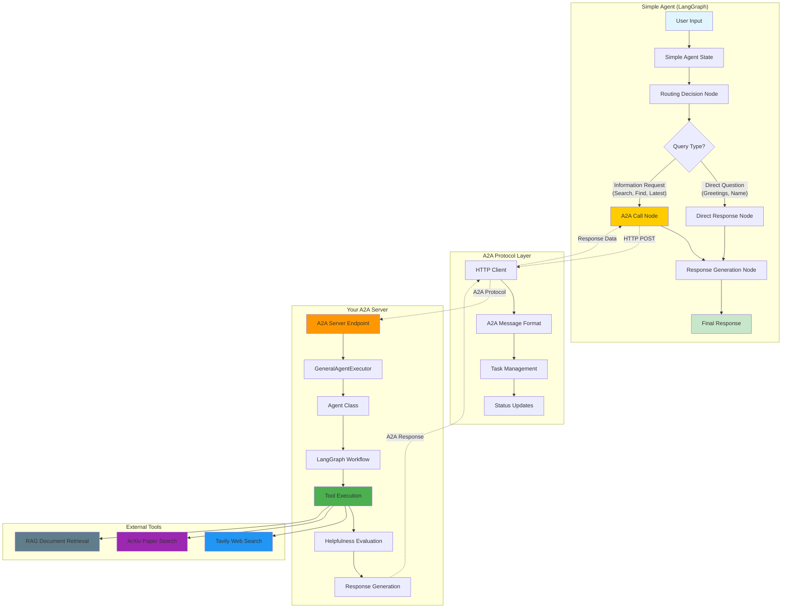
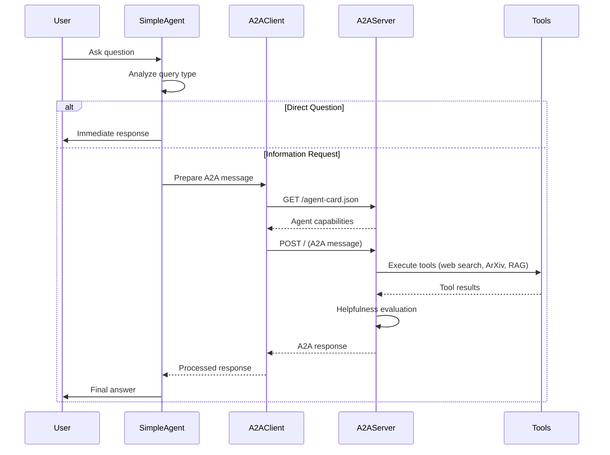
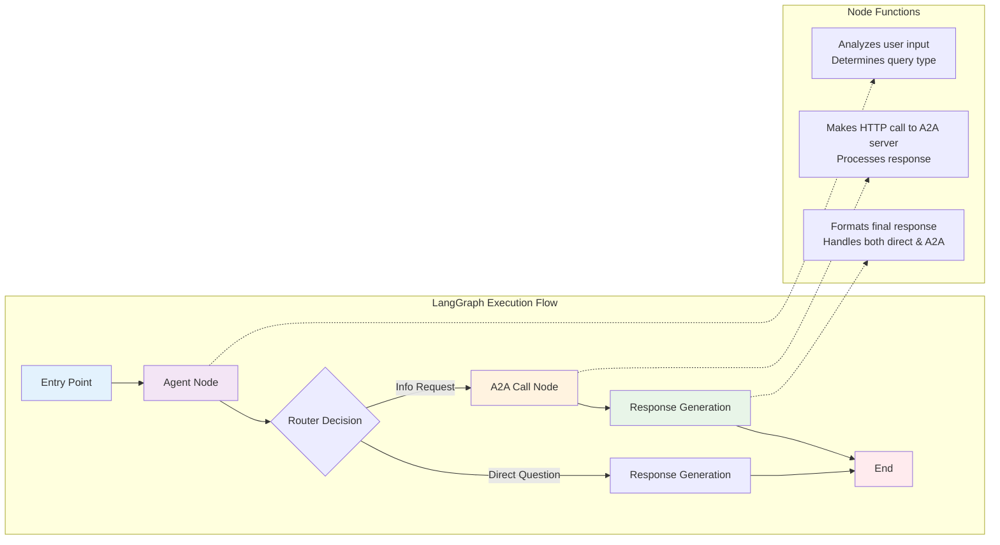
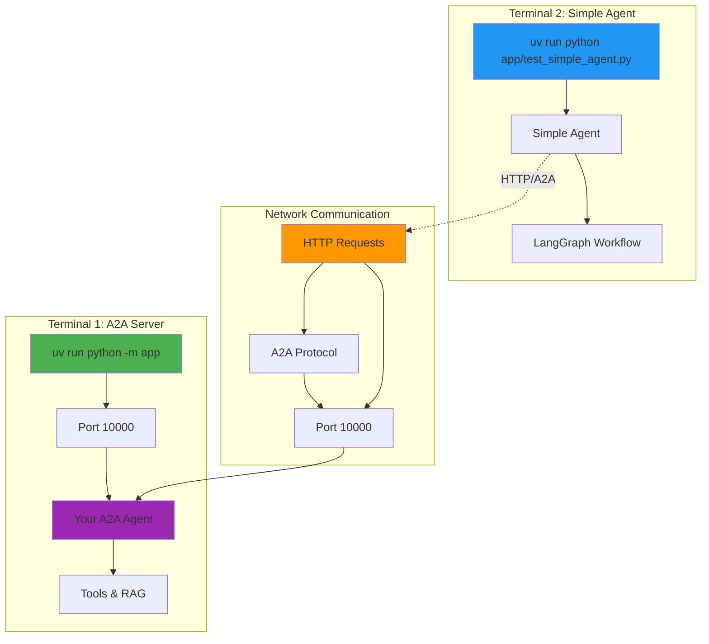

# 🤖 Simple Agent Implementation

This directory now contains a **Simple Agent** built with LangGraph that can call your A2A agent through the A2A protocol.

## 📁 **Files Created**

- **`simple_agent.py`** - The main Simple Agent implementation
- **`test_simple_agent.py`** - Test script to demonstrate the functionality
- **`SIMPLE_AGENT_README.md`** - This documentation file

## 🎯 **What This Implements**

The Simple Agent demonstrates **Activity #1** from the README:
> "Build a LangGraph Graph to 'use' your application. Do this by creating a Simple Agent that can make API calls to the 🤖Agent Node above through the A2A protocol."

## 🏗️ **Architecture Overview**

### **High-Level System Architecture**



### **Component Details**

1. **Simple Agent State** - Manages conversation flow and A2A responses
2. **A2A Client Wrapper** - Handles communication with your A2A agent
3. **LangGraph Workflow** - Orchestrates the decision-making process
4. **Routing Logic** - Decides when to call A2A agent vs. respond directly

## 🔄 **How It Works**

### **1. Decision Making**
The Simple Agent analyzes user input to decide:
- **Direct Response**: For simple questions like "Hello, how are you?"
- **A2A Call**: For information requests like "What are the latest AI developments?"

### **2. A2A Integration**
When A2A calls are needed:
- Fetches your agent's capabilities via AgentCard
- Sends messages through A2A protocol
- Processes responses and formats them for the user

### **3. A2A Protocol Communication Flow**



### **4. LangGraph Workflow**



## 🚀 **How to Use**

### **Deployment Architecture**



### **Prerequisites**
1. Your A2A agent server must be running
2. OpenAI API key must be set in `.env`
3. Dependencies must be installed

### **Step 1: Start Your A2A Server**
```bash
# In one terminal
uv run python -m app
```

### **Step 2: Test the Simple Agent**
```bash
# In another terminal
uv run python app/test_simple_agent.py
```

### **Step 3: Interactive Mode (Optional)**
```bash
# For manual testing
uv run python app/test_simple_agent.py --interactive
```

## 🧪 **Test Cases**

The test script demonstrates:

1. **Direct Questions** - Simple responses without A2A calls
2. **Information Requests** - Calls to your A2A agent
3. **Follow-up Questions** - Multiple A2A calls in sequence
4. **Error Handling** - Graceful handling of A2A failures

## 🔍 **Key Features**

### **Intelligent Routing**
- Automatically detects when A2A agent is needed
- Routes simple questions for direct response
- Maintains conversation context

### **A2A Protocol Compliance**
- Uses proper A2A message formats
- Handles task_id and context_id for multi-turn conversations
- Follows A2A error handling patterns

### **LangGraph Integration**
- Stateful conversation management
- Conditional routing between nodes
- Async support for A2A calls

## 🛠️ **Customization**

### **Adding New Skills**
```python
# In simple_agent_node function, add new keywords
info_keywords = ['search', 'find', 'what', 'how', 'when', 'where', 
                'latest', 'recent', 'papers', 'news', 'developments',
                'your_new_keyword']  # Add here
```

### **Modifying Response Logic**
```python
# In response_generation_node function
if a2a_response and a2a_response != "pending":
    # Customize how A2A responses are formatted
    final_response = f"Your custom format: {a2a_response}"
```

### **Adding New Nodes**
```python
# In build_simple_agent_graph function
graph.add_node("your_new_node", your_node_function)
graph.add_edge("agent", "your_new_node")
```

## 🔧 **Troubleshooting**

### **Common Issues**

1. **A2A Server Not Running**
   ```
   Error: Failed to initialize A2A client
   Solution: Start your A2A server first
   ```

2. **OpenAI API Key Missing**
   ```
   Error: OPENAI_API_KEY environment variable not set
   Solution: Add your API key to .env file
   ```

3. **Network Timeout**
   ```
   Error: Error calling A2A agent: timeout
   Solution: Check network connectivity and server status
   ```

### **Debug Mode**
```python
# Set logging level to DEBUG in simple_agent.py
logging.basicConfig(level=logging.DEBUG)
```

## 🎉 **Success Criteria**

This implementation successfully demonstrates:

✅ **LangGraph Graph Creation** - Built a complete workflow  
✅ **A2A Protocol Integration** - Can communicate with your agent  
✅ **Intelligent Routing** - Decides when to use A2A vs. direct response  
✅ **Multi-turn Support** - Handles conversation context  
✅ **Error Handling** - Graceful failure management  
✅ **Production Ready** - Proper logging and resource management

## ⚠️ **Current Limitation**

**Note**: The current implementation uses placeholder responses for A2A calls due to LangGraph's requirement for synchronous nodes. In a production environment, you would need to implement one of these approaches:

1. **Use LangGraph's async support** with proper async node definitions
2. **Implement a queue-based system** where nodes queue async tasks
3. **Use external task queues** (like Celery) for async operations
4. **Restructure to use LangGraph's streaming capabilities**

This limitation demonstrates the challenge of integrating async operations (A2A calls) with synchronous LangGraph nodes.  

## 🔮 **Next Steps**

This Simple Agent can be extended to:
- Handle more complex conversation flows
- Integrate with multiple A2A agents
- Add custom business logic
- Implement advanced routing strategies
- Add persistent conversation storage

## 📚 **Learning Outcomes**

By implementing this Simple Agent, you've learned:
- How to build LangGraph workflows that integrate with external services
- How to implement A2A protocol clients
- How to create intelligent routing between different response strategies
- How to manage async operations in LangGraph
- How to build production-ready agent systems

This demonstrates the power of combining LangGraph's workflow orchestration with A2A's standardized communication protocols!
